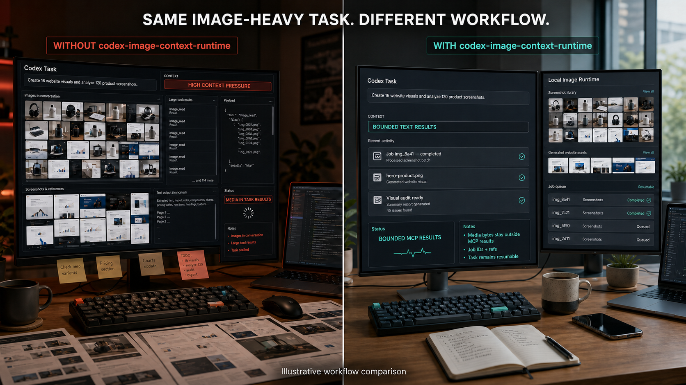

[简体中文](README.zh-CN.md)

# Image Context Runtime for Codex

**Keep image-heavy Codex workflows responsive, resumable, and context-bounded.**

*Fictional concept interface—not an actual Codex UI or a measured context, token, speed, or latency benchmark.*

Image Context Runtime for Codex is an experimental open-source Codex plugin backed by a durable local MCP runtime. It runs image generation and inspection as persisted jobs, keeps provider-returned media bytes behind the public MCP boundary, and returns only bounded text results, hashes, relative references, and Job IDs.

Use it when Codex is:

- creating short-drama character sheets, location concepts, or storyboards;
- producing image assets for websites and slide decks;
- organizing image-heavy news, books, screenshots, or research;
- generating many visual variations or running repeated visual QA.

> **Important:** This project reduces one source of context pressure. It does not claim that Codex can never slow down, that images use zero tokens, or that explicitly opening an image adds no visual context.

The plugin does not patch or intercept Codex's built-in image features or other image tools. The bounded boundary applies only when Codex uses this plugin's MCP tools and follows its bundled skill.

## What it is

**User-facing shape:** a Codex plugin.

**Execution shape:** a bundled local MCP server plus a durable image-job runtime.

~~~text
Codex skill
    |
    v
bounded MCP tools
    |
    v
durable local jobs ----> optional OpenAI API
    |
    +----> configured-workspace image artifacts
    |
    +----> bounded text handoffs, hashes, refs, and Job IDs
~~~

The plugin is the installable workflow. MCP is the tool boundary. The Runtime owns Job state, controls media transfer, and writes generated artifacts only to configured workspace-relative paths.

## Public v0.1 scope

- Text-to-image jobs.
- Image inspection jobs.
- Durable status and text handoffs.
- Idempotent submission.
- Restart reconciliation and explicit recovery.
- Offline deterministic mock provider.
- Optional OpenAI Image API and Responses API provider.
- Strict public-result budgets with no MCP image, audio, or resource blocks.

Video generation is intentionally out of scope for v0.1.

## Requirements

- Node.js 22 or later.
- Codex desktop app or Codex CLI with plugin support.
- No API key for the default mock provider.
- <code>OPENAI_API_KEY</code> only when the OpenAI provider is explicitly enabled.

## Install and configure

Clone this repository with GitHub's **Code** menu, then run the following commands from its root. The configuration helper runs outside Codex, so a local clone is required:

~~~powershell
codex plugin marketplace add .
codex plugin add codex-image-context-runtime@codex-image-context-runtime
~~~

The default provider is offline and deterministic, so installing the plugin cannot accidentally spend API credits.

For a first installation, choose **one** Provider configuration. For the offline mock:

~~~powershell
node plugins/codex-image-context-runtime/scripts/configure.mjs --workspace "C:\path\to\your\project" --provider mock
~~~

Or, for the optional OpenAI Provider, make the key available to the Codex process and configure OpenAI from the start:

~~~powershell
$env:OPENAI_API_KEY = "set-this-outside-the-repository"
node plugins/codex-image-context-runtime/scripts/configure.mjs --workspace "C:\path\to\your\project" --provider openai
~~~

The configuration file stores paths and model choices only. It never stores the API key.

The PowerShell environment assignment applies only to that shell and child processes. Launch Codex CLI from that shell, or use your operating system's environment/credential workflow before starting the desktop app. Restart Codex after configuration or credential changes.

To switch an existing mock setup to OpenAI, first stop the active worker, then replace the config and use a new Runtime directory so in-flight state is not mixed:

~~~powershell
node plugins/codex-image-context-runtime/scripts/configure.mjs --workspace "C:\path\to\your\project" --provider openai --runtime-dir "C:\path\to\image-runtime-openai" --force
~~~

## Example prompts

~~~text
Use Image Context Runtime to generate one 1024x1024 storyboard frame.
Keep the image bytes outside this task and return the Job ID.

Inspect images/frame-001.png for composition, continuity, and obvious text defects.
Return only the bounded inspection handoff.
~~~

The bundled skill instructs Codex to submit the job, poll by Job ID, and retrieve the compact handoff instead of asking the MCP server to return pixels.

## Providers

### Mock provider

- Default.
- Offline and deterministic.
- Creates a synthetic PNG for generation jobs.
- Returns metadata-oriented inspection text.
- Validates transport and persistence behavior, not visual quality.

### OpenAI provider

- Opt-in only.
- Uses <code>gpt-image-2</code> by default for image generation.
- Uses <code>gpt-5.6</code> by default for image inspection.
- Model names can be overridden in configuration.
- Media sent to the API is subject to the applicable service terms, pricing, and data controls.

This is an independent open-source project. It is not affiliated with or endorsed by OpenAI.

## Privacy boundary

Public MCP results:

- never contain provider-returned image bytes;
- never contain data URLs or base64 media;
- never contain API keys or raw provider responses;
- use relative artifact and handoff references;
- are capped by a UTF-8 byte budget.

The runtime can still send an image to an explicitly enabled remote provider for inspection. Local runtime ownership is not the same as offline processing.

The local job records persist prompts, inspection questions, relative references, and provider state. Protect the configured Runtime directory as project data.

## v0.1 concurrency boundary

One Runtime directory has exactly one active MCP worker. A second process targeting the same directory fails closed with <code>runtime_already_running</code> instead of reconciling or redispatching another live worker's jobs. A dead owner's stale PID lock is recovered on the next start.

If a process is forcibly killed during the millisecond-scale lock-takeover critical section, an empty <code>runtime.lock.guard</code> directory can remain. Verify that no worker is running before removing that guard manually; the Runtime never guesses that an acquisition guard is stale.

For simultaneous Codex tasks, use distinct configuration and Runtime directories. A shared multi-client broker is a later roadmap item; v0.1 does not pretend that process-local coordination is cross-session coordination.

See [Architecture](docs/architecture.md), [Tool reference](docs/tool-reference.md), [Claims](docs/claims-v0.1.md), [Benchmark methodology](docs/benchmark-methodology.md), [v0.1 validation receipt](docs/validation-v0.1.0.md), [Roadmap](ROADMAP.md), [Security](SECURITY.md), [Third-party services](THIRD_PARTY_SERVICES.md), and [Contributing](CONTRIBUTING.md).

## Synthetic payload benchmark

The included benchmark compares:

1. a deliberately naive MCP result that inlines synthetic image bytes; and
2. this runtime's bounded ref/hash/Job-ID result shape.

Run it with:

~~~powershell
npm run benchmark
~~~

This is a deterministic serialized-payload proxy. It is **not** a measurement of Codex tokens, latency, memory usage, or native image handling.

The checked-in v0.1 scenario models 20 jobs with 1 MiB synthetic images:

| Transport | Serialized MCP result bytes | Largest result |
|---|---:|---:|
| Naive inline-image baseline | 27,990,140 | 1,398,617 |
| Reference-only candidate | 27,060 | 739 |

That is a 99.903% reduction for this synthetic result-payload comparison only. See the methodology and reproducible JSON report before quoting it.

## Development

~~~powershell
npm test
npm run benchmark:verify
npm run check:privacy
~~~

All default tests are offline and make zero real provider calls.

## Status

v0.1 is an experimental public baseline. Review the threat model and data path before enabling a paid provider in a sensitive project.

## License

Apache License 2.0.
