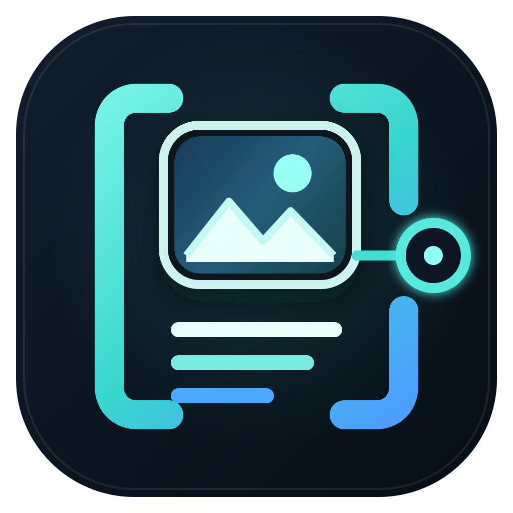

[English](README.md)

  

# Codex 图片上下文运行时

**让大量生图、读图工作保持有界、可恢复，而不是让媒体载荷持续进入主任务。**

*虚构概念界面；并非真实 Codex UI，也不是上下文、token、速度或延迟的实测基准。*

Codex 图片上下文运行时是一个实验性的开源 Codex 插件，后端由本地持久化 MCP 运行时驱动。它把图片生成与图片检查作为独立 Job 执行，将 Provider 返回的图片字节保留在公共 MCP 边界之外，只向 Codex 返回小型文本结果、哈希、相对引用和 Job ID。

适用场景包括：

- 批量制作短剧人物设定图、场景概念图与故事板；
- 制作网站、应用和 PPT 所需的图片素材；
- 整理包含大量图片的新闻、书籍、截图与研究资料；
- 连续生成视觉变体或执行多轮视觉 QA。

> **注意：**本项目只减少一种上下文压力来源。它不承诺 Codex 永远不会变慢，也不代表图片不消耗 token；当用户明确让 Codex 打开某张图片时，该图片仍可能进入视觉上下文。

本插件不会 patch 或拦截 Codex 内建图片能力，也不会自动改写其他生图工具。只有当 Codex 实际使用本插件的 MCP tools 并遵循内置 skill 时，这条有界边界才成立。

## 专业定位

- 用户安装的是：**Codex Plugin**
- Plugin 暴露的是：**本地 MCP 工具**
- 实际执行的是：**持久化图片 Job Runtime**

因此它不是单纯的生图 MCP 包装器，而是带有持久任务、幂等、重启恢复和有界文本交接的图片工作流基础设施。

## v0.1 范围

- 文生图 Job
- 图片检查 Job
- 持久化状态与文本交接
- 幂等提交
- 重启协调与显式恢复
- 默认离线 Mock Provider
- 可选 OpenAI Provider
- 32 KiB 公共 MCP 结果上限
- 16 KiB 文本交接上限

视频生成不属于 v0.1。

## 安装与配置

先 clone 已发布的标签，再从仓库根目录执行命令。配置助手需要在 Codex 外运行，因此需要本地 clone：

~~~powershell
git clone --depth 1 --branch v0.1.1 https://github.com/shixinnt/codex-image-context-runtime.git
cd codex-image-context-runtime
~~~

~~~powershell
codex plugin marketplace add .
codex plugin add codex-image-context-runtime@codex-image-context-runtime
~~~

首次安装请选择**一种** Provider 配置。默认 Mock Provider 不联网，也不会产生 API 费用：

~~~powershell
npm run configure -- --workspace "C:\path\to\your\project" --provider mock
~~~

Workspace 可以写绝对路径，也可以写相对于当前仓库 clone 目录的路径；自定义 `--config` 与 `--runtime-dir` 必须使用绝对路径。

或者从一开始就启用 OpenAI Provider，并确保 Codex 进程可以读取 Key：

~~~powershell
$env:OPENAI_API_KEY = "只在仓库外设置"
npm run configure -- --workspace "C:\path\to\your\project" --provider openai
~~~

配置文件不会保存 API Key。

上面的 PowerShell 环境变量只对当前 shell 及其子进程生效；请从同一 shell 启动 Codex CLI，或在启动桌面版之前使用操作系统的环境/凭据流程。配置或凭据改变后重启 Codex。

如果要把已有 Mock 配置切换为 OpenAI，请先停止活跃 worker，再用新 Runtime 目录覆盖配置，避免混用在途状态：

~~~powershell
npm run configure -- --workspace "C:\path\to\your\project" --provider openai --runtime-dir "C:\path\to\image-runtime-openai" --force
~~~

运行不会输出本机路径或凭据的诊断：

~~~powershell
npm run doctor
npm run doctor -- --json
~~~

Bash 环境可在启动 Codex 前设置 Key：

~~~sh
export OPENAI_API_KEY="只在仓库外设置"
npm run configure -- --workspace "/path/to/your/project" --provider openai
~~~

### 更新已有安装

先停止活跃图片 Job，然后更新 clone 并刷新 Codex 的插件缓存：

~~~powershell
git fetch --tags
git checkout v0.1.1
codex plugin remove codex-image-context-runtime@codex-image-context-runtime
codex plugin add codex-image-context-runtime@codex-image-context-runtime
~~~

配置与 Runtime 数据不在 clone 内，重装插件不会删除它们。更新后请重启 Codex。

Runtime 会在本地持久化 prompt、检查问题、相对引用与 Provider 状态，请把 Runtime 目录当作项目数据保护。

## v0.1 并发边界

同一个 Runtime 目录同时只允许一个 MCP worker。第二个进程会以 <code>runtime_already_running</code> 失败关闭，不会误判、接管或重复派发另一个活跃 worker 的 Job；原进程退出后，下一次启动可恢复失效的 PID 锁。

如果进程恰好在毫秒级的锁接管临界区被强制终止，可能留下空的 <code>runtime.lock.guard</code> 目录。请先确认没有 worker 正在运行，再手工删除该 guard；Runtime 不会猜测 acquisition guard 已经失效。

如需同时运行多个 Codex 任务，请为它们使用不同的配置与 Runtime 目录。共享多客户端 broker 属于后续路线图，v0.1 不把进程内协调包装成跨会话并发能力。

## 准确的能力边界

可以表述为：

- 减轻图片密集工作流的上下文压力；
- Provider 返回的图片字节不会进入公共 MCP 结果，生成产物只写入已配置的 workspace 相对路径；
- MCP 返回有界文本内容与紧凑 JSON 元数据；
- Job 可通过 Job ID 在重启后继续查询。

不能表述为：

- Codex 永远不会卡；
- 节省固定比例的 token；
- 图片零上下文；
- 所有 Provider 请求都可以断点续传；
- 本地 Runtime 等于数据绝不离开本机。

完整英文说明、架构、测试和 benchmark 请见 [README](README.md)。安装问题可先运行 `npm run doctor`，再查看[故障排查](docs/troubleshooting.md)与[支持说明](SUPPORT.md)；另见[隐私说明](PRIVACY.md)和[使用条款](TERMS.md)。

## 合成载荷基准

仓库内的可复现 v0.1 场景模拟 20 个各含 1 MiB 合成图片的 Job。朴素的内联图片 MCP 结果共 27,990,140 字节，引用式结果共 27,060 字节，在这项特定的 JSON 序列化结果载荷对比中减少 99.903%。

这不是 Codex token、延迟、内存、响应速度或原生图片处理的测量。详见英文 [benchmark 方法](docs/benchmark-methodology.md) 和机器可读报告。

本项目采用 Apache License 2.0，是独立开源项目，与 OpenAI 无隶属关系，也未获得 OpenAI 背书。

如果你在真实的图片密集任务中试用了本项目，欢迎在 GitHub Discussions 说明操作系统、Codex 版本/形态、大致图片负载，以及新的任务是否保持响应。提交问题时不要上传私密 Runtime 数据。
